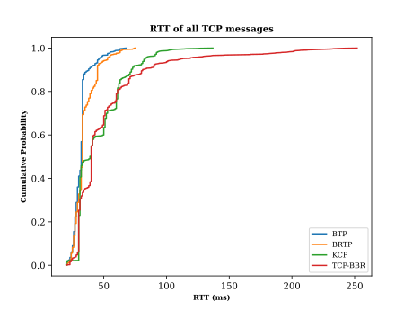

This binary is a minimized BATS protocol with the following limitations added:

- limited maximum input rate at 100Mbps.
- limited maximum running time at 80 seconds.
- limited feature set.
- required a software license to run.

For further cooperation, find us on the [n-hop technologies Limited](https://www.n-hop.com/).

If you want to run the test on your local machine, please contact [peng.lei@n-hop.com](peng.lei@n-hop.com) to obtain a free license key.

## About BATS Protocol

The BATS Protocol is a distributed network protocol developed based on the idea of network coding. It uses a novel coding scheme to achieve high throughput and low latency. The protocol software is implemented using modern C++ with dependencies on the standard C++ library and the Unix socket API. It provides basic functionality for the L3, L4, and L5 layers of the OSI seven-layer model.

The BATS Protocol supports multi-hop, multi-path, and multicast transmission modes. It also features a revolutionary congestion control algorithm optimized with network coding technology. Additionally, it has a dynamic adaptive coding rate based on packet loss detection. Compared to traditional protocols like TCP and UDP, as well as commonly used FEC transmission protocols like KCP, the BATS Protocol is more efficient and applicable to a wider range of scenarios.

### 1. Architecture

 

Fig 1.1 BATS Protocol Architecture

At the OSI network layer (L5), the BATS Protocol implements a rich set of IPC interfaces and supports multiple common programming languages, such as C++ and Python. This IPC serves as the interface between users and the BATS protocol, allowing any protocol to be converted into the BATS protocol.

At the OSI transport layer (L4), BATS Protocol implements two transmission modes: BTP and BRTP:

  - **BTP (BATS Transmission Protocol)** is the unreliable transmission mode of the BATS Protocol.
    
    Here, "unreliable" is a relative term, meaning that data transmission does not guarantee 100% reliability. However, in practical tests, BTP achieves a reliability rate close to 99% in scenarios where the packet loss rate is less than or equal to 30%. BTP is typically suited for scenarios where a small amount of packet loss is acceptable but low latency is crucial, such as real-time video calls.
  - **BRTP (BATS Reliable Transmission Protocol)** is the reliable transmission mode of the BATS Protocol.
  
    BRTP offers the same transmission reliability as TCP, but unlike TCP's stream-oriented nature, BRTP is a datagram-oriented reliable transmission protocol.

  - **BRTP_PROXY** is the optimized version of BRTP for accelerating the transmission of TCP traffic.

At the OSI network layer (L3), BATS Protocol supports both dynamic and static routing. The dynamic routing protocols currently supported include OLSR and Open-R.

### 2. Advanced Features

Already implemented advanced features include:

- **BATS Transmission Protocol (BTP)**
- **BATS Reliable Transmission Protocol (BRTP)**
- **Multi-hop transmission**
- **Link aggregation**
- **Adaptive coding rate**
- **Congestion control**
- **Dynamic routing support**

Features coming soon:

- **Advanced Congestion control algorithm**
- **Multi-path transmission**

### 3. Performance

The BATS Protocol has the competitive performance in terms of ultra-low latency; and the advantage is further amplified in multi-hop transmission networks.

To evaluate the performance of the BATS Protocol, we have conducted the following two tests with the parameters listed below:

- Link rate: 100Mbps
- Link delay: 5ms
- Link loss rate: 5%

### 3.1 Single hop test

 

Fig 3.1 Single hop RTT measurement

### 3.2 3-hop test

TODO