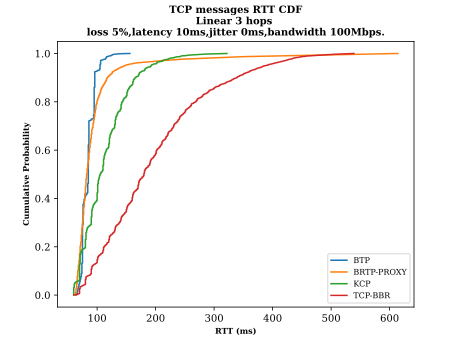
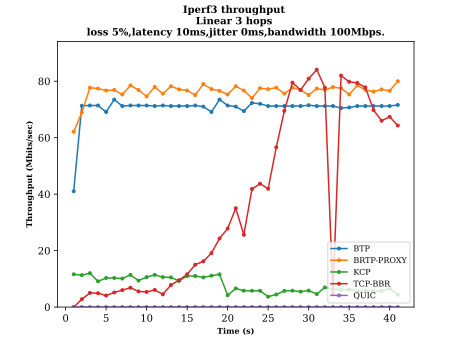

This binary is a minimized BATS™ protocol with the following limitations added:

- limited maximum input rate at 100Mbps.
- limited maximum running time at 80 seconds.
- limited feature set.
- required a software license to run.

For further collaboration, visit us at [n-hop Technologies Limited](https://www.n-hop.com/).

To run the tests on your local machine, please contact peng.lei@n-hop.com to obtain a free license key.

## Table of Contents
- [Table of Contents](#table-of-contents)
- [About BATS™ Protocol](#about-bats-protocol)
  - [2. Advanced Features](#2-advanced-features)
  - [3. Performance](#3-performance)
  - [3.1 Single hop test](#31-single-hop-test)
  - [3.2 Three hops test](#32-three-hops-test)
  - [3.3 Repeat the tests with Oasis](#33-repeat-the-tests-with-oasis)

## About BATS™ Protocol

The BATS™ Protocol is a distributed network protocol based on the concept of network coding. It employs a novel coding scheme ([BATS™](https://n-hop.com/wp-content/uploads/2022/12/BATS.pdf)) to achieve high throughput and low latency. The protocol software is implemented in modern C++ and provides basic functionality for the L3, L4, and L5 layers of the OSI seven-layer model. Currently, the BATS™ Protocol is not open-source.

The BATS™ Protocol supports multi-hop, multi-path, and multicast transmission modes. It features a revolutionary congestion control algorithm optimized with network coding technology and a dynamic adaptive coding rate based on packet loss detection. Compared to traditional protocols like TCP and UDP, as well as commonly used FEC transmission protocols like KCP, the BATS™ Protocol is more efficient and applicable to a wider range of scenarios.

<div align="center" style="text-align:center"> 
</div>
<div align="center">Fig 1.1 BATS Protocol Architecture</div>

At the OSI network layer (L5), the BATS™ Protocol implements a rich set of IPC interfaces and supports multiple common programming languages, such as C++ and Python. This IPC serves as the interface between users and the BATS™ Protocol, allowing any protocol to be converted into the BATS™ Protocol.

At the OSI transport layer (L4), the BATS™ Protocol implements two transmission modes: BTP and BRTP:

  - **BTP (BATS Transmission Protocol)** is the unreliable transmission mode of the BATS™ Protocol.
      
    Here, "unreliable" is a relative term, meaning that data transmission does not guarantee 100% reliability. However, in practical tests, BTP achieves a reliability rate close to 99% in scenarios where the packet loss rate is less than or equal to 30%(see evidence in [UDP test](#31-single-hop-test)). BTP is typically suited for scenarios where a small amount of packet loss is acceptable but low latency is crucial, such as real-time video calls.
  
  - **BRTP (BATS Reliable Transmission Protocol)** is the reliable transmission mode of the BATS™ Protocol.
  
    BRTP offers the same transmission reliability as TCP, but unlike TCP's stream-oriented nature, BRTP is a datagram-oriented reliable transmission protocol.

  - **BRTP_PROXY** is an optimized version of BRTP designed to accelerate the transmission of TCP traffic.

At the OSI network layer (L3), the BATS™ Protocol supports both dynamic and static routing. The dynamic routing protocols currently supported include OLSR and Open-R.

### 2. Advanced Features

Already implemented advanced features include:

- **BATS Transmission Protocol (BTP)**
- **BATS Reliable Transmission Protocol (BRTP)**
- **Multi-hop transmission**
- **Link aggregation**
- **Adaptive coding rate**
- **Congestion control**
- **Dynamic routing support**

Features coming soon:

- **Advanced Congestion control algorithm**
- **Multi-path transmission**

### 3. Performance

The BATS™ Protocol has the competitive performance in terms of ultra-low latency; and the advantage is further amplified in multi-hop transmission networks.

In the test, we used some protocols and tools which are listed in [Protocols and Tools](docs/protocols_and_tools.md).

In RTT measurement, `KCP` represents the RTT for TCP messages transmitted over `KCP`; and `BTP`,`BRTP`,`BRTP_PROXY` have the same meaning. TCP messages are transmitted in a rate of 100 packets per second with fixed length of 512 bytes.

In the first RTT measurement, we measured the RTT of the first TCP message transmitted over the protocol; the test results are averaged over 15 samples.

### 3.1 Single hop test

```
h0 -- h1
```

Take `h0` as the sender and `h1` as the receiver.

- TCP Throughput and RTT measurement

<div align="center" style="text-align:center"> 
</div>
<div align="center">Fig 3.1 Single hop RTT CDF</div>

<div align="center" style="text-align:center"> 
</div>
<div align="center">Fig 3.2 Single hop RTT over time</div>

<div align="center" style="text-align:center"> 
</div>
<div align="center">Fig 3.3 Single hop RTT of 1st TCP ping message</div>

<div align="center" style="text-align:center"> 
</div>
<div align="center">Fig 3.4 Single hop throughput test</div>

- UDP test:

<div align="center" style="text-align:center"> 
</div>
<div align="center">Fig 3.4.1 Single hop UDP test result</div>

- TCP Throughput under different link latency and loss rate:

  - Purpose: To evaluate the BATS protocol performance under different link latency and loss rate.
  - Chosen BATS Protocol: BRTP.

<div align="center" style="text-align:center"> 
</div>
<div align="center">Fig 3.4.2 BATS Protocol performance</div>

<div align="center">

| Loss Rate/Latency | 10ms | 30ms | 50ms | 70ms | 90ms | 110ms |
| ----------------- | ---- | ---- | ---- | ---- | ---- | ----- |
| 0.00%             | 91.7 | 90.5 | 86.1 | 87.1 | 84   | 79    |
| 2.00%             | 81.9 | 80.6 | 77.6 | 72.1 | 59.7 | 54.3  |
| 4.00%             | 77.5 | 76.8 | 72.9 | 70.8 | 58.8 | 52.3  |
| 6.00%             | 75.9 | 75.2 | 69.6 | 56.6 | 51.5 | 39    |
| 8.00%             | 73.3 | 72.4 | 68.5 | 65.9 | 48   | 42    |
| 10.00%            | 70.1 | 68.8 | 66.3 | 62.8 | 49.4 | 28.6  |

</div>
<div align="center">Table 3.4.2 BATS Protocol performance</div>

This test can be repeated in Oasis with running the following command:

```bash
sudo python3 src/start.py --containernet=default -p src/config -t bats-protocol-rtt-loss-test.yaml
```

Outputs of the above command:

- test_results/test1000/throughput_latency_loss.csv (Throughput data table in csv format)
- test_results/test1000/throughput_latency_loss.svg (3D bar plot)
- the original test records and logs for each selected latency and loss rate, such as `test_results/test1000/topology-10`

### 3.2 Three hops test

```
h0 -- h1 -- h2 -- h3
```

Take `h0` as the sender and `h3` as the receiver.

<div align="center" style="text-align:center"> 
</div>
<div align="center">Fig 3.5 Multiple hops RTT CDF</div>

<div align="center" style="text-align:center"> 
</div>
<div align="center">Fig 3.6 Multiple hops RTT over time</div>

<div align="center" style="text-align:center"> 
</div>
<div align="center">Fig 3.7 Multiple hops RTT of 1st TCP ping message</div>

<div align="center" style="text-align:center"> 
</div>
<div align="center">Fig 3.8 Multiple hops throughput test</div>

### 3.3 Repeat the tests with Oasis

The above tests can be repeated by Oasis with running the following command:

```bash
sudo python3 src/start.py -p src/config \
   --containernet=default 
  -t protocol-performance-comparison.yaml
```

For usage instructions for Oasis, please refer to the [Get Started](../docs/get-started.md).