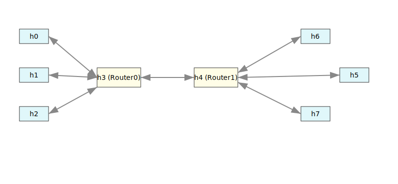

## The complex topology

The required topology for flow competition test is as follows:

<div align="center" style="text-align:center">
</div>
<div align="center">Fig 1.1 topology for flow competition test </div>

The test case configuration is as follows:

```yaml
tests:
  test1:
    description: "Flow competition test with multiple protocols"
    topology:
      config_name: complex_mesh_net
      config_file: predefined.topology.yaml
    target_protocols: [tcp-bbr]
    route: static_bfs
    test_tools:
      iperf:
        interval: 1
        interval_num: 10
        packet_type: tcp
        client_host: 2
        server_host: 5
    competition_flows:
      - flow_type: tcp # flow type
        client_host: 0 # the source node of the flow.
        server_host: 6 # the sink node the of flow.
        delay: 10 # the flow will be generated by delay 10 seconds.
        duration: 10 # the flow will last for 10 seconds.
```

The configuration examples are in `test/protocol-throughput-test-with-competition.yaml`.

- Supported `flow_type` in `competition_flows` section:
  - tcp (use `iperf3` as the flow generator)
  - btp (use `bats_iperf` as the flow generator)
  - brtp (use `bats_iperf` as the flow generator)
  - [protocol]-[cc]: tcp-bbr, tcp-cubic
  
- Supported `test_tools` which has no conflicts with `competition_flows`:
  - iperf
  - bats_iperf

In `competition_flows` section, it's allowed to add multiple flows.

### **Adjacency Matrix (8x8):**

```yaml
matrix_data:
   # 0  1  2  3  4  5  6  7
  - [0, 0, 0, 1, 0, 0, 0, 0]  # 0: h0
  - [0, 0, 0, 1, 0, 0, 0, 0]  # 1: h1
  - [0, 0, 0, 1, 0, 0, 0, 0]  # 2: target protocol sender
  - [1, 1, 1, 0, 1, 0, 0, 0]  # 3: Router0
  - [0, 0, 0, 1, 0, 1, 1, 1]  # 4: Router1
  - [0, 0, 0, 0, 1, 0, 0, 0]  # 5: target protocol receiver
  - [0, 0, 0, 0, 1, 0, 0, 0]  # 6: h0'
  - [0, 0, 0, 0, 1, 0, 0, 0]  # 7: h1'
```

**Legend:**  
- Each row and column is a node.
- A `1` at `[i][j]` means a link from node `i` to node `j`.
- The matrix is symmetric for bidirectional links.

**Bandwidths:**

Fixed 1000 Mbps for all links.

**Delay:**

Fixed 10 ms for all links.

**loss rate:**

The links which are connected to the router have a loss rate of 3% for each direction.
